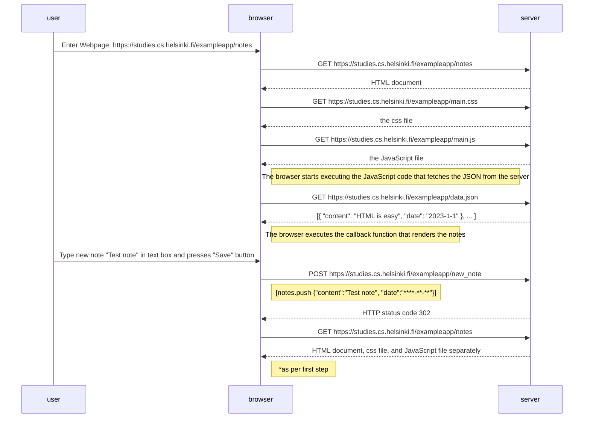

```mermaid
sequenceDiagram
    participant user
    participant browser
    participant server
    
    user->>browser: Enter Webpage: https://studies.cs.helsinki.fi/exampleapp/notes
    browser->>server: GET https://studies.cs.helsinki.fi/exampleapp/notes
    server-->>browser: HTML document
    
    browser->>server: GET https://studies.cs.helsinki.fi/exampleapp/main.css
    server-->>browser: the css file
    
    browser->>server: GET https://studies.cs.helsinki.fi/exampleapp/main.js
    server-->>browser: the JavaScript file
    
    Note right of browser: The browser starts executing the JavaScript code that fetches the JSON from the server
    
    browser->>server: GET https://studies.cs.helsinki.fi/exampleapp/data.json
    server-->>browser: [{ "content": "HTML is easy", "date": "2023-1-1" }, ... ]
 
    Note right of browser: The browser executes the callback function that renders the notes 

    user->>browser: Type new note "Test note" in text box and presses "Save" button

    browser->>server: POST https://studies.cs.helsinki.fi/exampleapp/new_note 
    Note right of browser: [notes.push {"content":"Test note", "date":"****-**-**"}]
    server-->>browser: HTTP status code 302

    browser->>server: GET https://studies.cs.helsinki.fi/exampleapp/notes
    server-->>browser: HTML document, css file, and JavaScript file separately

    Note right of browser: *as per first step

```