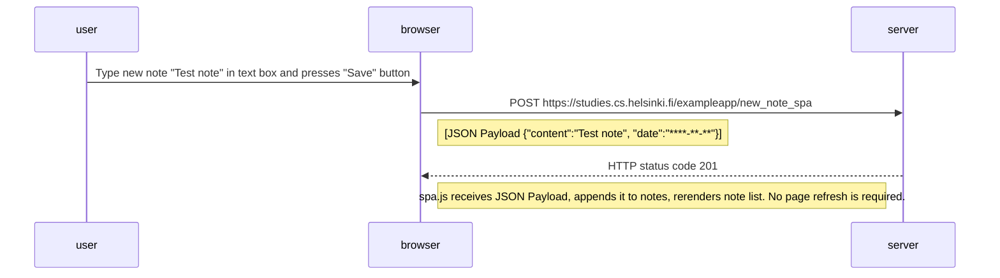

```mermaid
sequenceDiagram
    participant user
    participant browser
    participant server
    
    user->> browser: Type new note "Test note" in text box and presses "Save" button

    browser->>server: POST https://studies.cs.helsinki.fi/exampleapp/new_note_spa 
    Note right of browser: [JSON Payload {"content":"Test note", "date":"****-**-**"}]
    server-->>browser: HTTP status code 201

    Note right of browser: spa.js receives JSON Payload, appends it to notes, rerenders note list. No page refresh is required.
```    